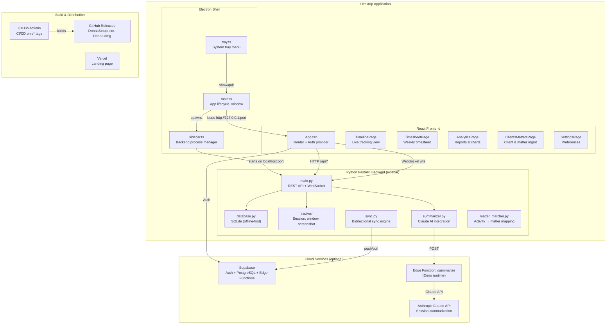
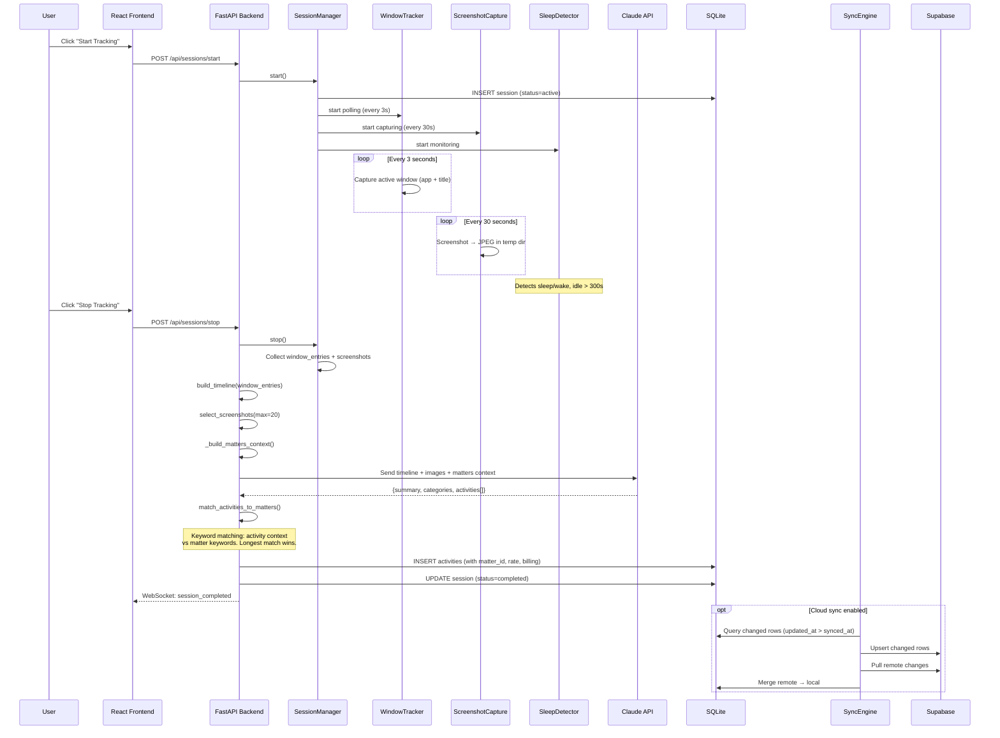
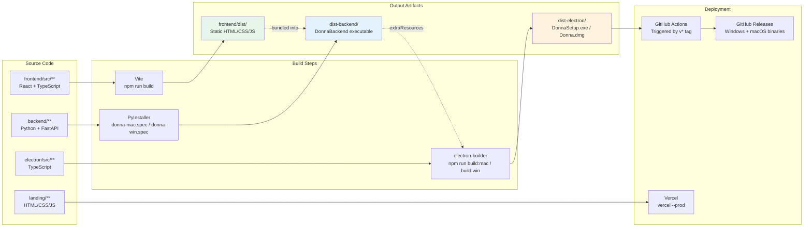
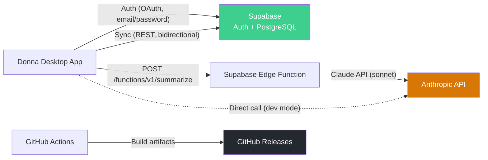
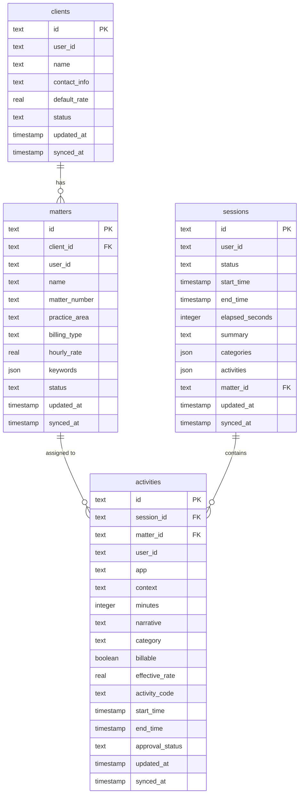

# Donna — System Architecture

## High-Level Overview

## Data Flow: Time Tracking Session

## Build & Deploy Pipeline

## Component Map

| Layer | Technology | Key Files | Purpose |
|-------|-----------|-----------|---------|
| **Electron Shell** | Electron 31, TypeScript | `electron/src/main.ts`, `sidecar.ts`, `tray.ts` | Desktop container, process management, system tray |
| **Frontend** | React 19, Vite, Tailwind CSS | `frontend/src/App.tsx`, `lib/api.ts`, `hooks/useAuth.tsx` | UI: timeline, timesheet, analytics, client/matter management |
| **Backend** | Python, FastAPI, Uvicorn | `backend/main.py`, `database.py`, `auth.py` | REST API, WebSocket, auth, business logic |
| **Tracking** | psutil, mss, platform APIs | `backend/tracker/session_manager.py`, `window_tracker.py`, `screenshot.py` | Window monitoring, screenshots, idle/sleep detection |
| **AI** | Anthropic Claude | `backend/summarizer.py`, `supabase/functions/summarize/index.ts` | Session summarization, activity classification, UTBMS codes |
| **Storage** | SQLite (local), PostgreSQL (cloud) | `backend/database.py`, `backend/sync.py` | Offline-first with optional cloud sync |
| **Cloud** | Supabase | `supabase/migrations/`, `supabase/functions/` | Auth, database, edge functions |
| **CI/CD** | GitHub Actions, electron-builder | `.github/workflows/build-desktop.yml` | Tag-triggered multi-platform builds + GitHub Releases |
| **Landing** | HTML/CSS/JS, Vercel | `landing/` | Marketing site with download links |

## External Services

## Database Schema

